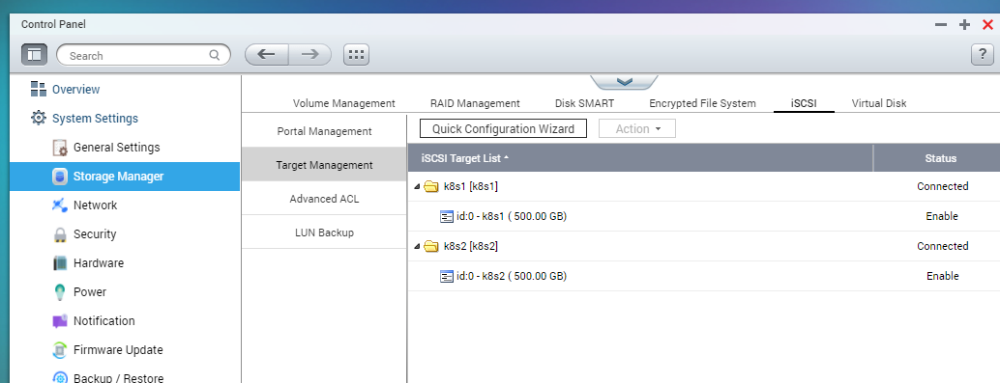

# Rook-Ceph

## Intro

The rook-ceph block provides the storage class - *rook-cephfs* -  for the kubernetes cluster.

## 🛒 Preparation

In my current setup I use iSCSI targets presented to the cluster nodes. These should be created (for the time being manually, in the NAS-s interface)



## 🧹 Cleaning preparation

If the cluster is being reinstalled, it is important to do a cleanup on each of the nodes:

- clean up disks

```sh
# Set the raw disk / raw partition path
DISK="/dev/sdb" # replace "sdb" with the relevant disk reference

# Zap the disk to a fresh, usable state (zap-all is important, b/c MBR has to be clean)
# Install: yum install gdisk -y Or apt install gdisk
sgdisk --zap-all $DISK

# Clean hdds with dd
dd if=/dev/zero of="$DISK" bs=1M count=100 oflag=direct,dsync

# Clean disks such as ssd with blkdiscard instead of dd
blkdiscard $DISK

# These steps only have to be run once on each node
# If rook sets up osds using ceph-volume, teardown leaves some devices mapped that lock the disks.
ls /dev/mapper/ceph-* | xargs -I% -- dmsetup remove %

# ceph-volume setup can leave ceph-<UUID> directories in /dev and /dev/mapper (unnecessary clutter)
rm -rf /dev/ceph-*
rm -rf /dev/mapper/ceph--*

# Inform the OS of partition table changes
partprobe $DISK

```

- Ensure to remove ceph datadir before install (check what is the path in the cluster.yaml  file at dataDirHostPath:  value) if you ever had rook on the worker nodes!

```sh
sudo rm -r /var/lib/rook -f
```

## 🤖 iSCSI reference (Ansible)

For the iSCSI installation I use Ansible. [this module](https://docs.ansible.com/ansible/latest/collections/community/general/open_iscsi_module.html)  should be installed for this.

In order for this to work, we need to collect the iSCSI targets from the NAS-s IP:

```sh
ubuntu@k8s-0:~$ sudo iscsiadm --mode discovery --op update --type sendtargets --portal 192.168.1.3
192.168.1.3:3260,1 iqn.2004-04.com.qnap:ts-809:iscsi.k8s1.c50b93
192.168.1.3:3260,1 iqn.2004-04.com.qnap:ts-809:iscsi.k8s2.c50b93
ubuntu@k8s-0:~$
```

Then we will need to update the task file (./.taskfiles/ansible.yml) with the corresponding worker/iscsi pars and tasks

```yaml
  # these are the iSCSI targets for each node
  WORKER1: "k8s-1"
  WORKER2: "k8s-2"
  ISCSI1: "iqn.2004-04.com.qnap:ts-809:iscsi.k8s1.c50b93"
  ISCSI2: "iqn.2004-04.com.qnap:ts-809:iscsi.k8s2.c50b93"
  # this should be your NAS or iSCSI server
  PORTAL: "192.168.1.3"

  ...omited...

    iscsi:
    desc: configure iscsi targets
    dir: provision/ansible
    cmds:
      # duplicate these lines for each host
      - "ansible-playbook -i {{.ANSIBLE_INVENTORY_DIR}}/hosts.yml {{.ANSIBLE_PLAYBOOK_DIR}}/iscsi.yml --extra-vars 'target={{.WORKER1}} portal={{.PORTAL}} iSCSI={{.ISCSI1}}'"
      - "ansible-playbook -i {{.ANSIBLE_INVENTORY_DIR}}/hosts.yml {{.ANSIBLE_PLAYBOOK_DIR}}/iscsi.yml --extra-vars 'target={{.WORKER2}} portal={{.PORTAL}} iSCSI={{.ISCSI2}}'"

  ```

Then run the task to set the targets:

```sh
task ansible:iscsi
```

Once this done, reboot the workers and check if the iSCI disk is still present (reboot is optional)

```sh
ubuntu@k8s-2:~$ lsblk
NAME   MAJ:MIN RM   SIZE RO TYPE MOUNTPOINT
loop0    7:0    0  55.4M  1 loop /snap/core18/2128
loop1    7:1    0  70.3M  1 loop /snap/lxd/21029
loop2    7:2    0  32.3M  1 loop /snap/snapd/12704
sda      8:0    0 111.8G  0 disk
├─sda1   8:1    0     1M  0 part
└─sda2   8:2    0 111.8G  0 part /
sdb      8:16   0   500G  0 disk
sr0     11:0    1   128M  0 rom
ubuntu@k8s-2:~$
```

(in my case sdb is an 500 GB iSCSI disk)

## 📋 Access dashboard

Once Rook is installed, retrieve the password, then you can log in to https://rook-ceph.${SECRET_DOMAIN}/#/dashboard using admin and this password

```sh
kubectl -n rook-ceph get secret rook-ceph-dashboard-password -o jsonpath="{['data']['password']}" | base64 --decode && echo
```

## References

<https://github.com/rook/rook/blob/master/Documentation/ceph-cluster-crd.md>

<https://computingforgeeks.com/how-to-deploy-rook-ceph-storage-on-kubernetes-cluster/>

<https://github.com/rook/rook/issues/3116>

<https://linuxhint.com/iscsi_storage_server_ubuntu/>

<https://askubuntu.com/questions/499246/iscsi-auto-startup-at-boot-14-04>

<https://docs.ceph.com/en/latest/rados/operations/add-or-rm-osds/>

<https://docs.ansible.com/ansible/latest/collections/community/general/open_iscsi_module.html>
